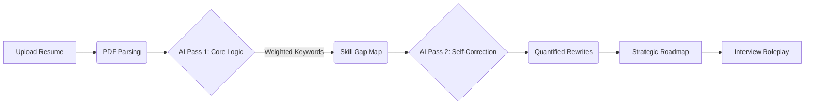

# 🚀 Resumind: AI-Powered Career Intelligence

<p align="center">
  
  
  
  
</p>

### Transform your career journey with FAANG-grade resume analysis, quantified impact rewriting, and interactive AI interview simulations.

---

## ✨ Overview

**Resumind** is a sophisticated full-stack ecosystem designed to bridge the gap between candidates and high-tier recruiters. By leveraging a dual-pass AI architecture (powered by **Llama 3.3 & Gemini**) within a robust Node.js environment, it performs deep semantic analysis, identifies technical skill gaps, and provides actionable "So What?" feedback.

### 🌟 Key Features

- 🧠 **Precision ATS Analysis** – Weighted scoring based on real-time JD frequency (not just keyword matching).
- 📈 **The "So What?" Test** – Automatically identifies weak bullet points and suggests quantified, high-impact rewrites.
- 💬 **Interactive Interview Roleplay** – A RAG-based chatbot that adopts a "FAANG Senior Recruiter" persona to challenge you on your specific resume details.
- ⚡ **Real-time SSE Streaming** – Watch the AI analyze your resume segment-by-segment with live status updates.
- 🔐 **Secure Ecosystem** – Google OAuth 2.0 integration and JWT-based session management.
- 📊 **Career Dashboard** – Track your application history, match scores, and strategic growth roadmaps.
- 📄 **Optimized Reproductions** – Generates a markdown-ready, optimized version of your resume based on AI feedback.

---

## 🛠️ Architecture & Tech Stack

| Layer | Technologies |
| :--- | :--- |
| **Frontend** | Next.js 14 (App Router), Tailwind CSS, Framer Motion, Lucide React, Recharts |
| **Backend** | Node.js, Express.js (Core Logic, Auth, File Handling) |
| **AI Engine** | Groq SDK (Llama 3.3 70B), PDF-Parse |
| **Data Layer** | MongoDB Atlas (Mongoose ODM) |
| **Authentication** | JWT, Google OAuth 2.0 |

---

## 📂 Project Structure

```text
ResumeAnalyser/
├── frontend/             # Next.js 14 Dashboard
│   ├── src/app           # App Router logic
│   └── tailwind.config   # Premium Styling
├── backend/              # Node.js API Service
│   ├── index.js          # Main Entry point (Analysis Logic)
│   ├── models.js         # MongoDB Schemas
│   └── uploads/          # Temporary Resume storage
├── Architecture/         # System design & Workflows
└── README.md             # Documentation
```

---

## ⚙️ Installation & Setup

### 1️⃣ Environment Configuration
Create a `.env` file in the `/backend` directory:
```env
MONGO_URI=your_mongodb_uri
PORT=5000
JWT_SECRET=your_jwt_secret
GROQ_API_KEY=your_groq_api_key
GOOGLE_CLIENT_ID=your_google_oauth_client_id
```

### 2️⃣ Backend Setup
```bash
cd backend
npm install
# Start backend
npm run dev
```

### 3️⃣ Frontend Setup
```bash
cd frontend
npm install
npm run dev
```
*Access the dashboard at `http://localhost:3000`*

---

## 📸 AI Analysis Pipeline



---

## 🙌 Author

**Anjali Patel**  
Final Year Engineering Student | AI Full-Stack Developer  
[GitHub Profile](https://github.com/Anjal08)

---
*Developed as a high-performance career tool to demonstrate the integration of LLMs with modern web architectures.*
